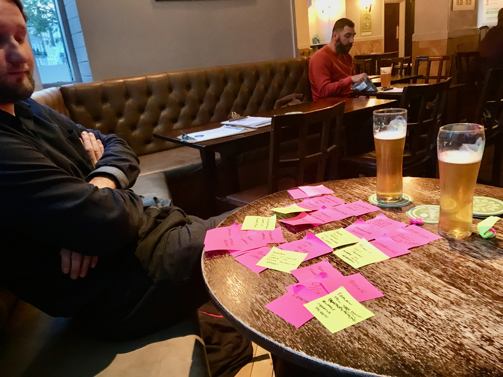

I've been working on and off in the field of 'tech industry training' for nearly a decade now. I want to talk about how I make the journey from an initial conversation with a customer to being ready to deliver the training.

I have evolved a top-down outcome-driven method for course design and thought I would give away my secret sauce in the spirit of sharing. I was never formally trained in Education so this probably overlaps with some existing best practices in the field.

Obviously the way I _actually_ do it varies slightly with each engagement, but this is the rough framework.

This is the first of two articles, and will cover my process from initial client engagement to accepted proposal. A later article will cover what I do once they say yes.

# Giving some credit

I started doing training with [Marcello Duarte](https://twitter.com/_md) after seeing him deliver some great training at my former company. We worked together for ~5 years and I learned a lot about:

1. Marcello's official, structured, documented, 'how to design training' system
2. The system he _actually_ used
3. Emergency systems that come into play when you're told about something you have to deliver _tomorrow_ in a subject you know _nothing about_

(I learned a lot about delivery during that job too but that's not the main subject of this post)

Another big influence is the way [Cucumber](https://cucumber.io/school/) design and deliver their training.

I've contributed and delivered their BDD courses in-person and online, and their very interactive courses helped me step back from some of the heavily-presentational style I'd been using for my own courses.

In particular co-delivering training with [Matt Wynne](https://twitter.com/mattwynne), and using the excellent trainer notes from [Seb Rose](https://twitter.com/sebrose) have really fed back into my style.

# What sort of training formats am I talking about?

I'm mostly contacted by people who:
- Want training in a specific area, often technical or process-related
- Are thinking in terms of 'buying some days of training', typically 0.5 to 3 days.
- May want me to 'deliver the course' multiple times across teams.

Long-term I think ongoing coaching tends to be more effective than _just_ training courses, but I tend to conform to those expectations for an initial engagement and offer coaching activities as part of follow-up.

For a new area of practice, a training course from an external authority figure is often be a good way to show commitment from the organisation to a new initiative, and can mark a transitional moment where the team 'starts doing X'.

Incidentally, I tend to think if you're a smart person you can learn any subject well enough to deliver it to a group of learners effectively. The key role of a trainer is to think about how to educate people in a subject clearly, in the right order, and leave them with the right learning outcomes. The skills to do that are subject-agnostic.

I'm going to go through my typical steps in this sort of engagement, with a running worked example of a typical course.

# Step 1. Understanding the expectations

My first goal is to try and understand what's being asked for.

There aren't set questions to ask, but you're trying to get some key understandings. There are two perspectives I want to explore. If I can I'll cover them in one call.

## Talk to a 'boss'

I talk to someone who is approving the spend on the training, but isn't going to attend it.

They'll have a good perspective of what external outcomes will make them willing to spend money and team-time on a piece of training, without it being driven by personal interest in a subject.

It's important to understand:
- What problems do they hope it will address?
- What concrete changes do they hope to see after the training?
- Who would be attending and why?
- What is the overall scope in terms of time and money?

I try and capture real key phrases in my notes. After the call they might look something like this:

> Bob Johnson - development manager - Pyjamas-by-post Ltd
>
> Java team 4 ppl, React team 4 ppl - single product, 2 work streams
>
> Features not being developed at pace would like
>
> Backlog growing 'nothing gets done'
>
> NOT lack of technical skill
>
> 1-2d 'agile training', no budget
>
> Items get dragged from sprint to sprint
>
> 'make sure they are doing it right'
>
> 'see what they can improve'
>
> Ideal outcome: 'things getting unblocked'

The general impression is that there's a slowness/inefficiency in the dev teams that needs to be unblocked

## Talk to a potential attendee

I want to talk someone who is going to come on the course and will have an insider view on why the training is needed.

They can tell me:
- Is the business correct about the problems they have?
- How do _they_ think this subject area will help?
- What other issues could this training solve that aren't visible outside the team?
- What is the current level of knowledge in the relevant areas?
- Who else could benefit from training, who isn't being considered?

Example notes:

> Freya Thorsdottir - team lead Java
>
> 'we do stuff that never gets used'
>
> 2-3 months between Java team complete + FE team complete
>
> 'spend a lot of time working out what we're supposed to be doing'
>
> 'stuff just gets dropped on us' by PM
>
> Scrum-ish proc - planning, stand-ups, review, no retros
>
> No prior agile training
>
> 'requirements don't make sense'

The vibe here is that there are also systematic issues in how work flows into or out of the team that are causing a lot of the problems.

## Follow-up if needed

For a small bit of training this may be enough to go ahead, but if there are large areas of uncertainty or other people referenced who would be useful to talk I would then arrange  some similar follow-up calls.

I just want to get to the level of understanding to be confident in the next step.

# Step 2. Connect business needs to learning outcomes
 
While I still have context from the conversations, I'll try and create a map that links my understanding of the problem with the outcomes of the training.

This is very much 'starting with the end in mind'.

I normally only spend 20 minutes at a time on this whole step, let it rest, then come back fresh later.

I capture this offline or online in various formats. A table is best for this post, but you can imagine a grid of stickies if you prefer. What I want to share really is the order of thinking.

I want to emphasise that I do this very scrappily, then refine it. To prove that, here is a picture taken a few years ago with [Jakub Zalas](https://twitter.com/jakzal)



We had an in-person meeting with a customer, went for lunch around the corner, and did most of this step on the table. The result was refined and formed the backbone of a 2-day course, delivered across more than 15 teams.

## List the Business's needs

I think about the scope of the problem I've been faced with, what the stated needs were, and what other needs I think may be present.  I then enumerate them in _no particular order_.

From the example conversations I might end up with this (for a small example):

| Needs | 
|:------|
| More collaboration between Java and FE teams |
| Clearer requirements at sprint start          |
| Improved throughput of work |
| Shorter backlogs |
| Focus on finishing |

## Add appropriate learning outcomes for attendees

Inspired by these needs, I then try and write as many  learning outcomes as I can that would address each need.

I am not too strict about the definition of an outcome, I mostly think of them as a change in the attendees as a result of the course.

If I feel like attendees will be from lots of different roles, I will also capture those. If it's a room full of developers I'd skip it.

I don't write it out this way, but you could think of it as:

```
Given I am a <role>
When I attend this course
Then I <outcome>
And that will contribute to <business need>
```

While writing them I'm considering the existing knowledge level of attendees, and what seems practical to achieve.

For instance for a training course aimed at experienced Ops professionals, an achievable goal of the training might be:

> Can apply a service mesh to their existing Kubernetes deployment

… implying that they'll leave the course ready to do it in their next sprint.

For a less experienced group, or if it's one subject amongst many, I might write:

> Knows what a service mesh is, and can explain the benefits of using one

… where the aim of the course is to introduce a concept and give them some motivation towards learning more.

I capture the understanding in two new columns (working right-to-left):

| Target learners | Outcomes | Needs |
|:------|:------|:------|
| Delivery teams and product stakeholders | Can describe how 'shifting left' promotes shared understanding | More collaboration between Java and FE teams |
| Delivery teams and product stakeholders | Can list the key characteristics of a clear requirements document | Clearer requirements at sprint start  |
| Delivery teams and product stakeholders | Can name five ways to slice a feature  | Clearer requirements at sprint start  |
| Delivery teams and product stakeholders | Can take part in an effective backlog review | Clearer requirements at sprint start          |
| Delivery teams | Can explain why limiting work in progress improves flow | Improved throughput of work |
| Delivery teams | Know why it's important to keep backlogs short | Shorter backlogs |
| Delivery teams | Have a shared understanding of what backlogs exist and their appropriate sizes | Shorter backlogs |
| Delivery teams | Have a way to measure business impact of work vs effort | Focus on finishing |
| Delivery teams | Understand the importance of slack time to increase responsiveness | Focus on finishing |

## Shuffle and refine

Once I run out of ideas, I try to narrow the options down and shuffle things around into an order that:

- seems like it's telling a story - introducing concepts in the right order
- groups together subjects that some attendees could skip
- gives some idea of how it would be broken into day-length blocks

I'll try out different arrangements of the ideas, working out which to take out to fit if there feels like too much.

I'll add/reword/remove stuff as I go, to try and get to an achievable set of goals for the course length constraints.

As it starts to look more concrete and achievable, I remove the learner column (and merge it into the days if I split the learners)

| Day | Outcomes | Needs |
|:------|:------|:------|
| 1 (All) | Can describe how 'shifting left' promotes shared understanding | More collaboration between Java and FE teams |
|  | Can name five ways to slice a feature  | Clearer requirements at sprint start  |
|  | Can take part in an effective backlog review | Clearer requirements at sprint start          |
| 2 (Delivery teams) | Know why it's important to keep backlogs short | Shorter backlogs |
|  | Have a shared understanding of what backlogs exist and their appropriate sizes | Shorter backlogs |
|  | Be able to measure and identify bottlenecks in their progress | Focus on finishing |
|  | Understand the importance of slack time to increase responsiveness | Focus on finishing |

# Step 3. Pitch it!

This is the point at which I'd send an email proposal of the training.

I _do not_ drill into the specific activities, no least because they're not set yet.

There are a couple reasons I prefer to pitch at this level.

Firstly, I design bespoke training and really try to tailor it to the customer. I can't therefore afford to design a course in explicit detail before they've committed to go ahead.

That consideration won't apply as much if it's a course you're designing to deliver repeatedly (e.g. a regularly-run public course).

At this point in my career I trust myself to be able to build a course that fulfils the outcomes in the time available.

If it was an area entirely outside my knowledge, or I was a less experienced in training, I might do more of the later steps before pitching.

Secondly, when the customer is making a purchasing decision I want the benefits they'll get to be front and centre. I want them to be considering:

> "Do I want to pay £££ to get these outcomes for the team?"

Rather than thinking:

> "Do I want to pay this guy £££ to run these activities?"

For that reason, even if you've gone through the next steps to build your own confidence, I'd still only pitch on the outcomes.

My emails are fairly casual, and directly inspired by my meeting notes and the outline so far, with some accommodations to match the recipient's language:

```
Hi Bob

Thanks to you and Freja for your time, I think I've got a good understanding 
of the key challenges you are facing:

 - The backlog of work is increasing, but you don't think the bottlenecks 
 are technical
 - Items are started and not finished for some time later
 - The sprints are not regularly delivering value

The training would aim to:
 - Increase the effectiveness of hand-off between Java and FE teams
 - Improve the clarity of requirements to reduce misunderstandings and waste
 - Focus the team on finishing work in progress instead of taking on more

I suggest we deliver 2-day course around Agile topics with some BDD themes that 
would address some of your specific issues, with non-technical roles involved 
heavily in day 1.

Title: Agile Product Development

Day 1: The two delivery teams, Product Owner, BAs

Attendees will learn how to:
 - describe how earlier collaboration promotes a shared understanding 
 of requirements
 - slice a feature into smaller achievable chunks, using appropriate strategies
 - have effective backlog reviews to ensure clear requirements at sprint start
 
Day 2: The two delivery teams only

After this day attendees will:
 - understand why shorter backlogs improve responsively
 - have a clear model of how work moves through the various backlogs of the 
 delivery team processes
 - be able to identify and unblock bottlenecks in the delivery team
 
For this, [COMMERCIAL DETAILS GO HERE, NEAR TO BENEFITS]

Please let me know how you want to proceed.
```

If I've managed to understand what their issues are and explain how I'd address them, I'll generally expect a rapid reply.

## What next?

Once things are approved, you will have:

 1. Business problems to address
 2. Outcomes the course will try to deliver
 3. Length of course

This is a solid foundation for building a training course. How we go from here to 'ready to deliver' will be the subject of the next article!
